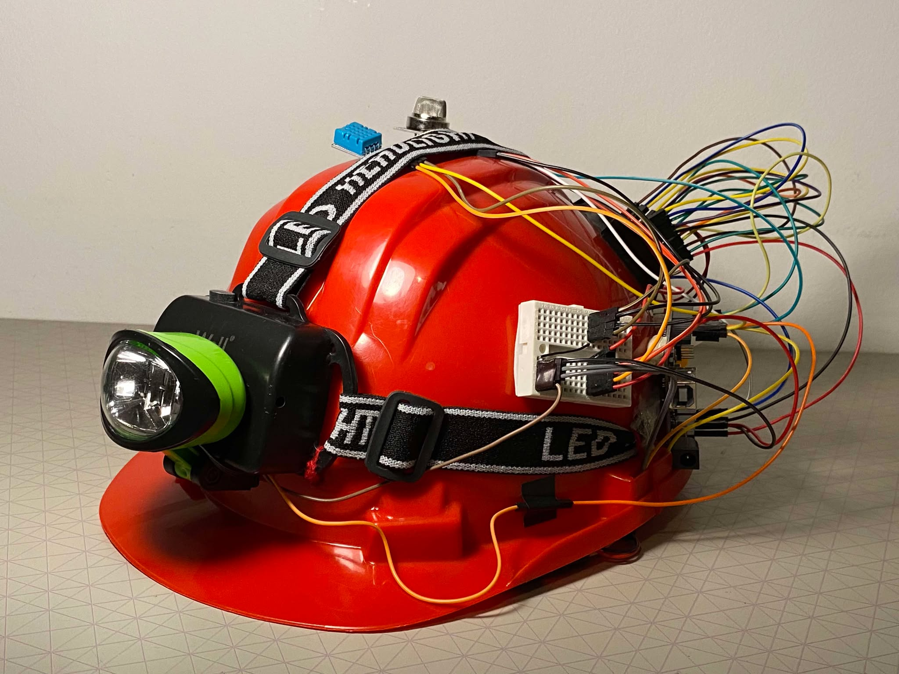
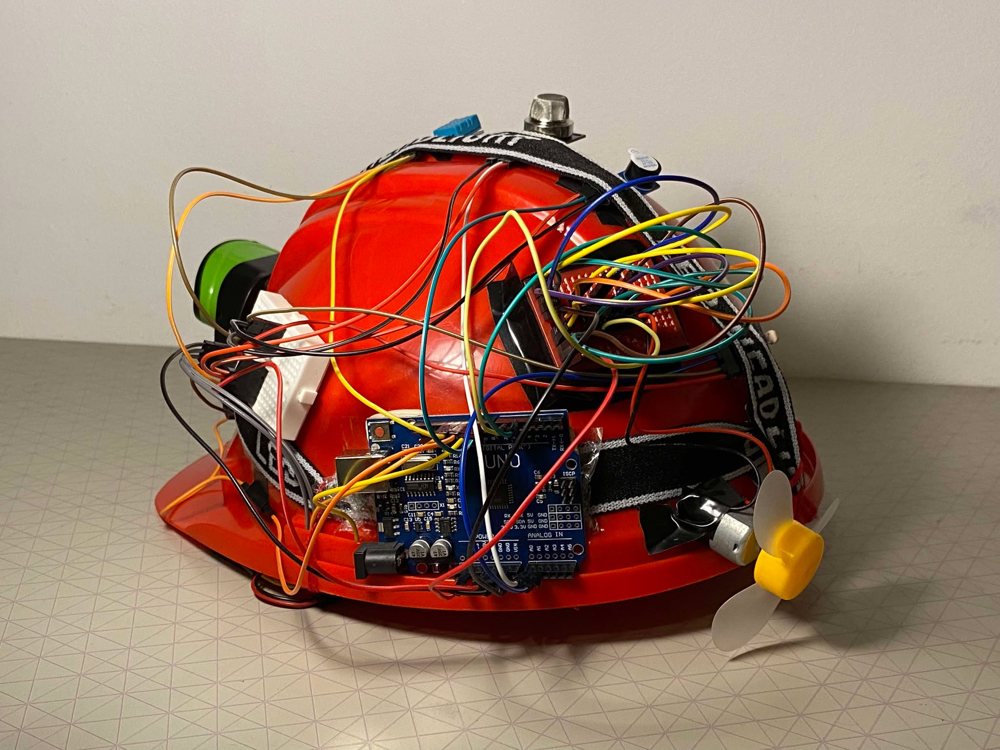
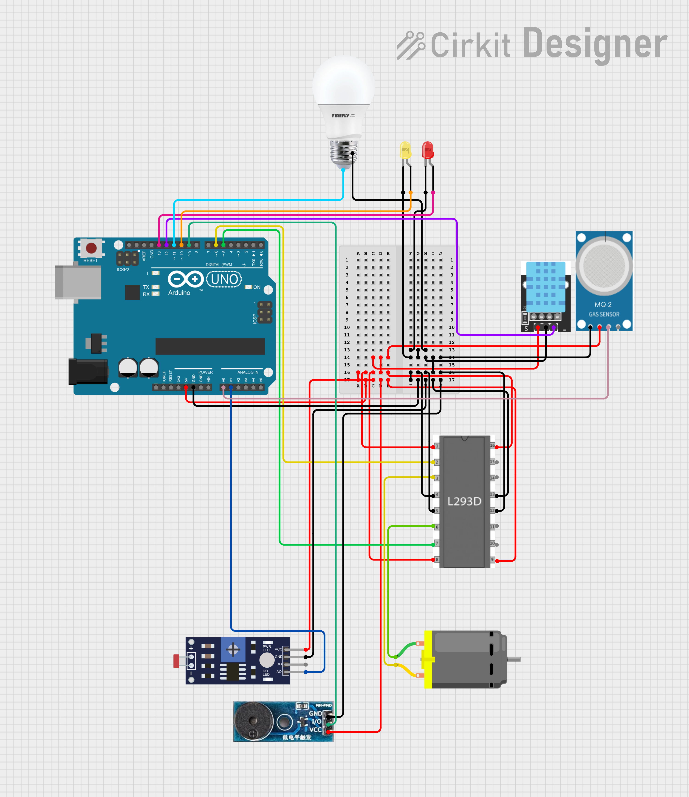

# Miners-Safety-Helmet-Arduino

## Project Description

This project aims to implement a safety system designed specifically for coal miners. The smart helmet automatically monitors environmental conditions, providing warnings for hazardous gas levels, extreme temperatures, and insufficient light. This not only enhances miners' safety but also increases productivity by eliminating the need for manual testing with multiple devices.

 

   
   

---

## Components Used

To develop this project, the following components were used:

1. **Arduino Uno board**;
2. **MQ-2 Gas Sensor**: Measures methane (CH4) and carbon monoxide (CO) levels. Data acquisition is performed via the analog pin A0.
3. **DHT11 Temperature and Humidity Sensor**: Measures ambient temperature. Data acquisition is performed via the digital pin 12.
4. **Light Sensor with Photocell Module**: Measures light levels. Data acquisition is performed via the analog pin A1.
5. **Active Buzzer Module**: Emits distinct warning sounds for different hazard levels. Controlled via pin 9.
6. **LED Indicators**:  
   - Red LED (connected to pin 13): Indicates gas concentration hazards.  
   - Yellow LED (connected to pin 10): Indicates temperature hazards.
7. **LED Headlamp**: Turns on in low-light conditions. Powered via pin 11.
8. **Fan**: Activates when temperature exceeds 25°C. Controlled via the motor driver.
9. **L293D Motor Driver**: Controls the fan motor. Connected to pins 5 and 6 for input.
10. **Resistors**: Two 200-ohm resistors for circuit connections.
11. **Breadboard**: For connecting components.
12. **Jumper Wires**: For wiring the circuit.
13. **Protective Helmet**: To house all components.

 

   

---

## Functional Overview

### Gas Detection
- The MQ-2 sensor detects the presence of methane (CH4) and carbon monoxide (CO) gases.
  - If gas concentration exceeds **0%**, the red LED blinks, and the buzzer emits a warning sound.
  - If gas concentration exceeds **3.3%**, the red LED blinks, and the buzzer emits a distinct alarm for higher danger.

### Temperature Monitoring
- The DHT11 sensor monitors temperature.
  - If the temperature is above **25°C** or below **-5°C**, the yellow LED blinks, and the buzzer emits a unique warning sound.
  - If the temperature is above **25°C**, the fan is automatically activated via the L293D motor driver to cool the miner. The fan switches off when the temperature drops below this threshold.

### Hazard Priority
- In the event of both gas and temperature hazards, the gas hazard takes priority due to the higher risk of explosion.

### Light Detection
- The light sensor triggers the LED headlamp.
  - If the measured light intensity is below a threshold (analog value < 600), the headlamp turns on.
  - Otherwise, the headlamp remains off.

---

## Libraries Used

The project code is written in Arduino IDE and utilizes the following libraries:
1. [DHT Sensor Library](https://github.com/adafruit/DHT-sensor-library): For interfacing with the DHT11 sensor.
2. [Adafruit Sensor Library](https://github.com/adafruit/Adafruit_Sensor): For additional sensor functionalities.

---

## How to Use

1. Assemble the components as described in the "Components Used" section.
2. Upload the code to the Arduino Uno board using Arduino IDE.
